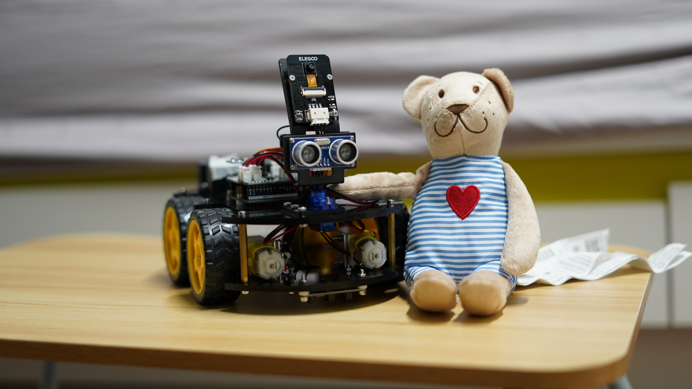

<p align="center">
    
</p>

<h1 align="center">Tele Driving of a Mobile Robot</h1>

## Project Description

The "Tele Driving of a Mobile Robot" project, a design and innovation project (DIP) in the School of EEE at NTU (Singpaore), is focused on enhancing remote operation capabilities in critical rescue operations. At its core is an Arduino-based mobile robot, remotely controlled by a human operator using a steering wheel and pedal system. The robot is equipped with a camera that transmits real-time visual feedback, crucial for navigating through challenging environments. Additionally, the project employs an advanced indoor positioning system (IPS) using Ultra-wideband (UWB) technology, consisting of multiple base stations and a tag on the robot for precise location tracking. This positional data is then seamlessly integrated into a Unity-based simulator, providing the operator with a comprehensive and dynamic map of the robot's location. This map serves as a crucial tool for strategic planning and decision-making in complex indoor rescue scenarios.

For more details, please refer to the [project slides](doc/project_slide.pptx), [demo video](doc/demo_video.mp4), and [project report](doc/project_report.pdf).

## Key Features:

1. **_Remote Control Interface:_** Utilizing a steering wheel and pedal set, operators can control the mobile robot from a remote location, ensuring safety and efficiency.

2. **_Real-Time Visual Feedback:_** Equipped with a camera, the robot transmits live visual feedback to the operator, providing a clear view of the robot's surroundings and aiding in navigation and task execution.

3. **_Indoor Positioning System:_** An IPS using UWB technology is integrated. This includes several base stations and a tag on the Arduino car, enabling precise location tracking.

4. **_Unity-Based Simulation Mapping:_** The position data from the IPS is fed into a Unity-based simulator, creating a dynamic map. This map serves as a macroscopic view for the operator, enhancing situational awareness and aiding in strategic planning.

## How to use

1. Specify the path to the opencv library in the `configuration.json` file. (Notice that `/` rather than `\` is used.) For instance:

   ```json
   {
     "opencv_dir": "D:/Program Files/opencv/build"
   }
   ```

2. Specify the ip address of the web camera in the `configuration.json` file. For instance:

   ```json
   {
     "cam_ip": "192.168.59.246"
   }
   ```

3. Specify the wifi name and password in the `configuration.json` file. For instance:

   ```json
   {
     "wifi_name": "TP-LINK_2.4GHz_1F",
     "wifi_password": "12345678"
   }
   ```

4. **_Arduino Part_**: Use Arduino IDE to upload the `Arduino/Main/Main.ino` file to the esp32 board.

5. **_Controller and Antenna Part_**: Compile the project using the CMakeLists.txt file. Then run the executable file in the `out` folder.

6. **_Unity Part_**: Open the project using Unity Hub and run the project.

## Known issues

1. The opencv library sometimes cannot be found by the compiler. And the following error message is displayed.

   ```
   The code execution cannot proceed because opencv_world480.dll was not found. Reinstalling the program may fix this problem.

   The code execution cannot proceed because opencv_world480d.dll was not found. Reinstalling the program may fix this problem.
   ```

   This is could be caused by the fact that the library is not installed in the default location. To solve this issue, find the following files in the `opencv/build/x64/vc16/bin` folder and copy them to the `C:\Windows\System32` folder. (XXX is the version number of the library, for instance, 480 means version 4.8.0)

   - opencv_worldXXX.dll
   - opencv_worldXXXd.dll

2. The file location of the coordinates.txt file could be wrong. If the file is not found, the program will create a new file in the current directory. To solve this issue, you have to manually modified the file location in the following locations:
   - `Antenna\PGRtls\D-DWM-PG.cs` - `WriteTextToFile()`
   - `Unity\Assets\DUDUNSPARCE.cs` - `FixedUpdate()`

## Contact

If you have any questions, please contact the following members of the team:

- Controller Part:
  - TOK JUN WEI: tokj0002@e.ntu.edu.sg
  - JIANGPENG LI: jiangpen001@e.ntu.edu.sg
- Arduino Part:
  - TOK JUN WEI: tokj0002@e.ntu.edu.sg
  - DYLAN TEO WEN JUN: dteo018@e.ntu.edu.sg
  - APICHART YAPAKDEE: apichart001@e.ntu.edu.sg
  - JIANGPENG LI: jiangpen001@e.ntu.edu.sg
- Antenna Part:
  - AW ZETING: zaw009@e.ntu.edu.sg
  - JIANGPENG LI: jiangpen001@e.ntu.edu.sg
- Unity Part:
  - AW ZETING: zaw009@e.ntu.edu.sg
  - AGNES ANG JIA HUI: aang036@e.ntu.edu.sg
  - MEIQI ZHAO: meiqi.zhao@ntu.edu.sg
